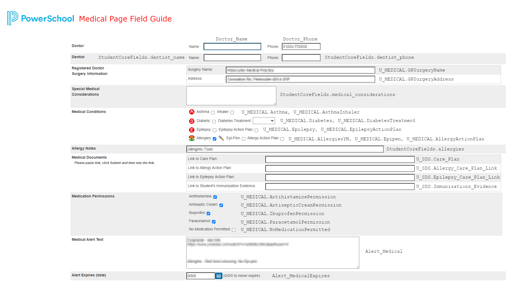

<h1 align="center">🚨 ISA PowerSchool Alerts Plugin</h1>

* Adds custom alerts to PowerSchool Admin, Teacher & Attendance Screens
* Alerts use PowerSchool fields to render specific student information based on various parameters that can be set by admin staff.
* Adds many features to the `Emergency / Medical Page` of PowerSchool Admin that allows medical staff to control alerts and information relating to a students medical needs. 

<p align="center">
    
</p>

### [Historical Versions](https://github.com/InternationalSchoolAberdeen/ISAPowerSchoolPlugins/tree/main/ISA%20Alerts%20Plugin/Previous%20Versions)

## 🗃 Packaging The Plugin
> For each version update, update the `plugin.xml` and increment the `version` field <br>
> Select the `web_root` folder and the `plugin.xml` and add them both to a ZIP file <br>
> This ZIP file can then be uploaded to the `Plugin Management Screen` of PS

## ❓ Adding Alerts for New PowerSchool Fields

1. Firstly, make sure you have a boolean field that can be used to control if the alert is shown or not, something like, `U_ALERTS.Test_Alert` that can take a `0` or a `1` as a value.
2. Next, create a file in `web_root/admin/alerts` with the title of your alert .html, e.g. `testAlert.html`. 
3. Copy the code below into your `testAlert.html`

```html
<div class="box-round" id="alert-~(studentfrn)">
	
	<div class="alertContent">
		<h2 tabindex="0">
			Test Alert
		</h2>
		<p style="text-align: center;">
			Either some pre-set text, <br>
            or a value from a PowerSchool Field, e.g. ~(U_ALERTS.Test_Alert_Text)
		</p>
	</div>
</div>
```
4. You can also now create a custom alert icon, like the ones displayed above with dimensions of `20px x 20px` that can be linked into the alert, replacing `/images/isa_alert.youralertimage.png` with the relative link to your image.
5. Now, to have the alert display on the student page in PowerSchool Admin, edit `web_root/wildcards/isa_alerts.txt`. And copy the following code to the top of the file, (or between the alerts where you want the new alert to show up).

```html
~([students.U_ALERTS]Test_Alert;if.fieldvalue.0.then=;if.fieldvalue.1.then=
<a title="Your Alert Title" href="/admin/alerts/testAlert.html?frn=~(frn)" class="dialogM">
    
</a>)
```

6. That is all that has to be done for an admin only alert. To add an alert for the teacher side of PowerSchool the following steps have to be done.
7. Make a copy of your `testAlert.html` and place it in `web_root/teachers/alerts`.
8. Next, open up `web_root/wildcards/isa_alerts_teachers.txt` and add the following code.

```html
~([students.U_ALERTS]Test_Alert;if.fieldvalue.0.then=;if.fieldvalue.1.then=
<a title="Your Alert Title" href="/teachers/alerts/testAlert.html?frn=~(frn)" class="dialogM">
    
</a>)
```

9. Now your alert will show up on the student screens, however to add it to the attendance screen, a few more steps have to be done.
10. Open up the file, `\web_root\teachers\classattendance.isa_alerts.content.footer.txt` & copy the following code, editing the `variable name`, `table name` & `field name` to match those for your custom alert. Paste this editied code below the last SQL query in the file, and before `// Function Step 2`.

```sql
var testAlertRows (<- change me) = {
        ~[tlist_sql;
        select cc.id, s.dcid
        from cc cc
        join students s on s.id = cc.studentid
    left outer join u_alerts ( <- change me) on u_sds.studentsdcid = s.dcid
        where cc.sectionid = ~(gpv.sectionid;sqlText)
            and to_date('~(gpv.att_date;sqlText)','~[datetext:mmddyyyy]') between cc.dateenrolled and cc.dateleft-1
        and u_alerts.test_alert (<- change me) = 1 
        ]"~(1)":"~(2)",[/tlist_sql]"":""

};
```

11. Now the final step is to copy the code below, again changing the alert `<a />` to match the one from the `isa_alerts_teachers.txt`, replacing the `frn=~(frn)` with `frn=001'+ studcid +'`

```js
$j.each(carePlanRows, function(ccid, studcid) {
    $j('tr[id=ccid_' + ccid + '] td:eq(1)').append('<a style="padding-right:5px;" title="Test Alert" href="/teachers/alerts/testAlert.html?frn=001'+ studcid +'" class="dialogM"></a>');
});
```
12. Now paste this below the comment `// Function Step 2` and if all goes well, you can upload the plugin, enable it, log into PowerTeacher and see your new alert for all the students that have that value set to `1`!

## 🏥 Medical Page
* This plugin makes major changes to make the default PowerSchool `Medical / Emergency Page` more useful. It also adds in checkbox's and links for ISA's SDS custom fields which, in turn, are used to render the alerts.
* Below is a help sheet for each of the fields used in the medical page, <i>(I kept forgetting which was which)</i>

<p align="center">
    
</p>

## 📚 Changelog

- `v1.86`: Added new links for plans and also for expiry dates
- `v1.85`: Added in new alert for no medication consent.
- `v1.84`: Added new care plan alert to PowerTeacher and Attendance Screens
- `v1.83`: New medical alert altered to be for if student has a medical care plan + minor changes to layout of medical page
- `v1.82`: New Medical Alert Created to Replace Old one, using same fields and values
- `v1.81`: Minor changes to the medical page
- `v1.80`: Fixed issue where html elements were called a different name on live site vs. test server
- `v1.79`: Added test links for the fields on the medical page
- `v1.78`: Updated Medical page with more doctor info and medication permissions
- `v1.77`: Updated Medical page and formatted doctor info w/ jQuery (absolute pain)
- `v1.76`: Minor fixes ready for prod. PS
- `v1.75`: Fixed image consent alert coming up when it shouldn't
- `v1.74`: Updated order of alerts and changed some of the text inside them.
- `v1.73`: Fixed medical page colors and debugged jQuery errors, fixed spacing on alerts in the attendance screen of PowerTeacher Pro 
- `v1.72`: Fixed medical page allergy notes and title w/ jQuery
- `v1.71`: Changed color of document icon to match that of the schools light blue branding color
- `v1.70`: Updated order of alert icons in PowerTeacher & Removed Random text boxes from the medical page
- `v1.69`: Medical Page Completed and Formatted
- `v1.65`: Updated Text and Icons for EAL / LS Alerts
- `v1.63`: Added new alerts to PowerTeacher and attendance screen
- `v1.61`: Added LS & EAL Alerts w/ new icons to PS Admin
- `v1.60`: Added in links for SDS Documents into Alert on PowerTeacher
- `v1.59`: Added in links for SDS Documents into Alert on PS Admin
- `v1.58`: Cleaned up icons and made them more consistent
- `v1.52 - v1.57`: Added in SDS alert to admin and teacher screens + attendance screen
- `v1.47 - v1.51`: Added alerts to attendance screen and did minor cleanup of the code base
- `v1.46`: Attempt at adding new alerts into the attendance screen of PowerTeacher
- `v1.45`: Added alert code into the PowerTeacher Screen, so that they popup when clicked on by a teacher
- `v1.44`: Fixed link formatting, added epilepsy care plan link into popup & added in immunization evidence SDS Text Input to Medical Page
- `v1.43`: Added allergy care plan link into pop-up box depending on if the link field `U_SDS.Allergy_Care_Plan_Link` is empty or not
- `v1.42`: Added in links for different medical documents into the Emergency / Medical Page in PowerSchool Admin
- `v1.41`: Cleaned up code & the formatting of text within the alert icons
