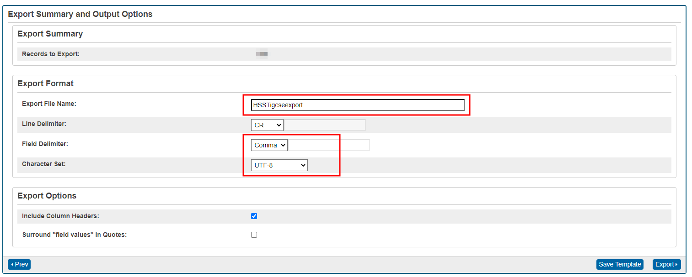
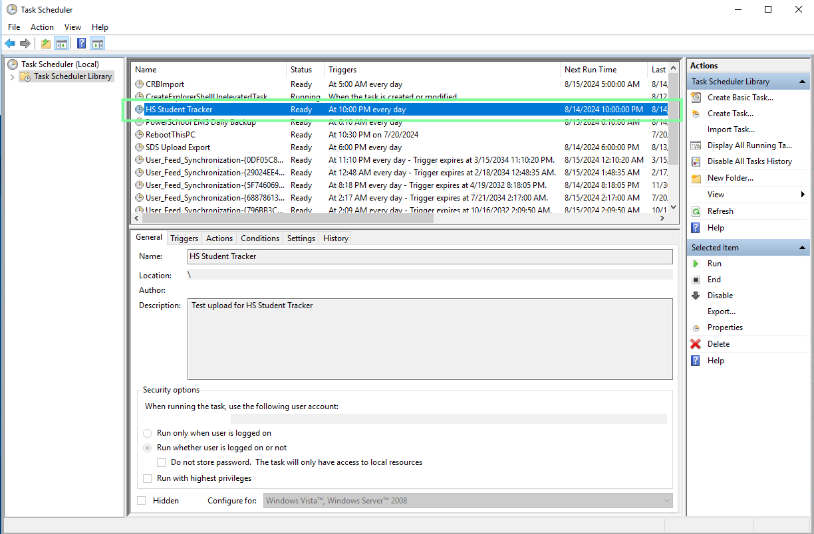

<h1 align="center"> 🕵️ ISA's PowerSchool + Looker Studio Student Tracker</h1> 

> [!Important]
> PowerSchool SIS Export + `GAMADV-XT3` upload script + Google Sheets.

# Adding PowerQueries
> [!NOTE]
> To add more SQL queries to be able to use more data please edit the queries in `ISA HSST PowerQuery Plugin\queries_root\hsst.named_queries.xml`. Then increment version number in `plugin.xml`, zip the plugin & install on PS.

Queries are formatted in XML blocks, below is an example of what a new PowerQuery should look like

```xml
<query name="dev.finnlestrange.hsst.storedgrades.exportquery" coreTable="students" flattened="true">
    <description>Exports all stored grades for HS students for all years they have been in HS.</description>
    <columns>
        <column column="TrackerSG.01StudentNumber">01StudentNumber</column>
        <column column="TrackerSG.02Name">02Name</column>
        <column column="TrackerSG.03GGradeLevel">03GGradeLevel</column>
        <column column="TrackerSG.04StoredGradeLevel">04StoredGradeLevel</column>
        <column column="TrackerSG.05Term">05Term</column>
        <column column="TrackerSG.06Course">06Course</column>
        <column column="TrackerSG.07Grade">07Grade</column>
    </columns> 
    <sql>
        <![CDATA[
        SELECT 
            s.student_number,
            s.LastFirst, 
            s.grade_level,
            sg.grade_level stgrade_level,
            sg.storecode,  
            sg.course_name,
            sg.grade
        FROM students s
        LEFT JOIN storedgrades sg
            ON sg.studentid = s.id
            AND sg.grade_level IN (9, 10, 11, 12)
            AND sg.storecode IN ('S1', 'P1', 'S2', 'P2')
        WHERE s.grade_level IN (9, 10, 11, 12)
            AND s.enroll_status = 0
        ORDER BY s.grade_level, s.LastFirst, sg.storecode
        ]]>
    </sql>
</query>
```
You can make use of the PowerSchool SQL Studio Plugin to verify SQL syntax & ensure that you are getting the correct data exported.

# Setup & Documentation 

> [!note]
> **Please Note** : you must have an instance of `GAMADV-XT3` configured on your live PowerSchool server along with having an authenticated oAuth session and GAM project that has full domain access.

## Configuring PowerSchool Exports
First install the plugin `ISA HHST PowerQuerys` located in this repo, `ISA PS Plugins/ISA HSST PowerQuery Plugin`. This allows you to use custom SQL queries to pull out specific data for export.

> [!Warning]
> Make sure the names of the columns in the export template match those you are going to use in Google Sheets / Looker Studio.

Next, head to the Export Page - `/admin/datamgmt/exporttemplates.html#/export-schedule-content` & setup new export templates using these powerqueries and the fields they return.

> [!Warning]
> Please also ensure that the export settings specify `UTF-8` encoding and `comma` as the delimiter.
> 

Then head to the `My Templates` and setup scheduled exports for each of the new export templates.

## GAM Upload Script
* The script runs a windows scheduled task every night after powerschool has exported the list of students alongside their grades + learning standard data.


* This task scheduler runs a `.bat` file that contains the following script.

```shell
cd ..
d:
cd GAMADV-XTD3
D:\GAMADV-XTD3\gam.exe user gveitch@isa.aberdeen.sch.uk update drivefile 1eZcoamEcugJNRFcf8Y4rIuuCTWemKZpRHL6sOYdcZEQ csvsheet id:423274577 localfile D:\PSShare\external\autosend\HSST\HSSTstoredgradesexport retainname
echo "Uploaded Stored Grades Sheet"

D:\GAMADV-XTD3\gam.exe user gveitch@isa.aberdeen.sch.uk update drivefile 1eZcoamEcugJNRFcf8Y4rIuuCTWemKZpRHL6sOYdcZEQ csvsheet id:381211607 localfile D:\PSShare\external\autosend\HSST\HSSTcemtestexport retainname
echo "Uploaded CEM Test Results" 

D:\GAMADV-XTD3\gam.exe user gveitch@isa.aberdeen.sch.uk update drivefile 1eZcoamEcugJNRFcf8Y4rIuuCTWemKZpRHL6sOYdcZEQ csvsheet id:1159097062 localfile D:\PSShare\external\autosend\HSST\HSSTigcseexport retainname
echo "Uploaded IGCSE Results" 

D:\GAMADV-XTD3\gam.exe user gveitch@isa.aberdeen.sch.uk update drivefile 1eZcoamEcugJNRFcf8Y4rIuuCTWemKZpRHL6sOYdcZEQ csvsheet id:912099034 localfile D:\PSShare\external\autosend\HSST\HSSTmaptestexport retainname
echo "Uploaded Map Test Scores"

echo "Script Finished."
```

Where:
* `$gam-user-email` - The email you have configured for access using `GAM`
* `$spreadsheet-id` - The ID of the Gooogle Spreadsheet containing the sheet to update
* `$sheet-id` - The ID of the Google Sheet to update, i.e. `MAP` test results sheet has id of `884738384`, this means that the data from the local export csv will only go into the sheet matching that ID.

> [!Tip]
> This then will populate the sheets specified by IDs and the data will be ready for Looker Studio.

* To add more data sources, setup new sheets within your master spreadsheet, then make note of the sheet id, it is in the URL after the main spreadsheet id. 
* Then setup your new queries within the plugin & update the plugin version on PS.
* Use new PowerQueries to create new export template which you can schedule.
* Once all setup, update the `.bat` script and add another line, specifing the new `sheeet id` and `file` to upload. This will then automatically upload all the files you have specified within the `.bat` script.`