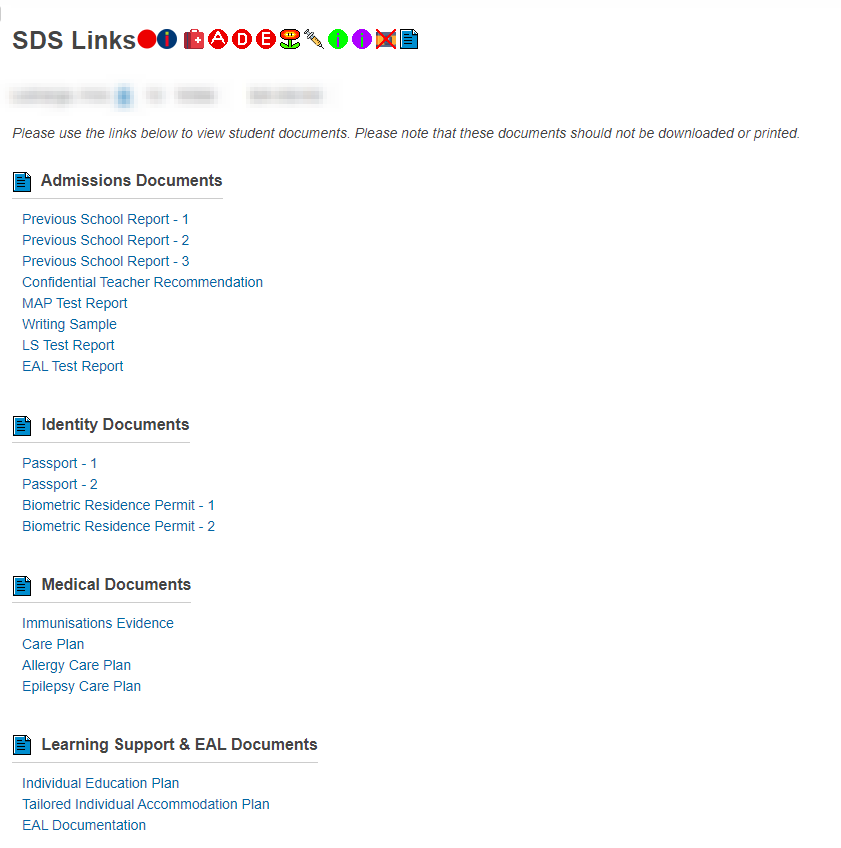

<h1 align="center">📃 ISA Student Document Storage PS Plugin</h1>

* Adds custom links and pages to access student documents that are stored in Google Drive. 
* Adds custom screens for PowerSchool Admin, Teacher and PowerTeacher Pro
* Integrates with the `ISA Alerts Plugin` to add documents into custom student alerts 

    

### [Historical Versions](https://github.com/InternationalSchoolAberdeen/ISAPowerSchoolPlugins/tree/main/ISA%20SDS%20Plugin/Previous%20Versions)

## 🗃 Packaging The Plugin
> For each version update, update the `plugin.xml` and increment the `version` field  
> Select the `web_root` folder and the `plugin.xml` and add them both to a ZIP file  
> This ZIP file can then be uploaded to the `Plugin Management Screen` of PS

## 📚 Changelog 

* `v1.51`: Updated plugin with various bug fixes and minor additions
* `v1.47`: Updated PowerTeacher links page to add test links for iep, tiap and eal docs
* `v1.46`: Minor changes to PowerTeacher Portal to remove Semester Tabs from `SDS Links` page
* `v1.45`: Minor fixes ready for prod. PS
* `v1.44`: Changed Alert text input to textarea rather than `input`
* `v1.43`: Fixed page titles to be more cohesive 
* `v1.42`: Updated SDS Links to have the LS Update Options at the bottom if the teacher is in `Security Group 12`
* `v1.41`: Added Learning Support Update Page to PowerTeacher
* `v1.40`: Removed TIAP alert & Fixed order of EAL and LS Alert Info in the update page